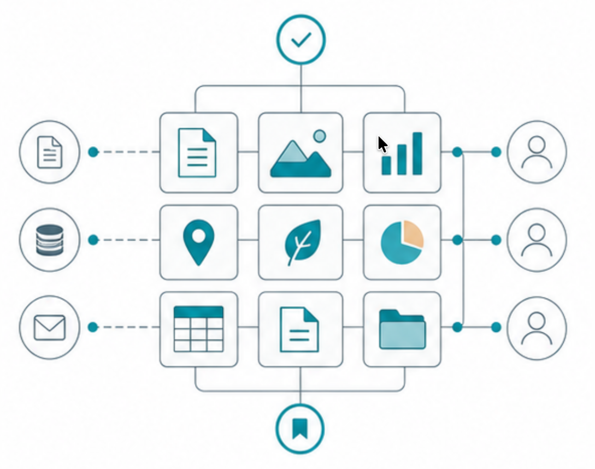
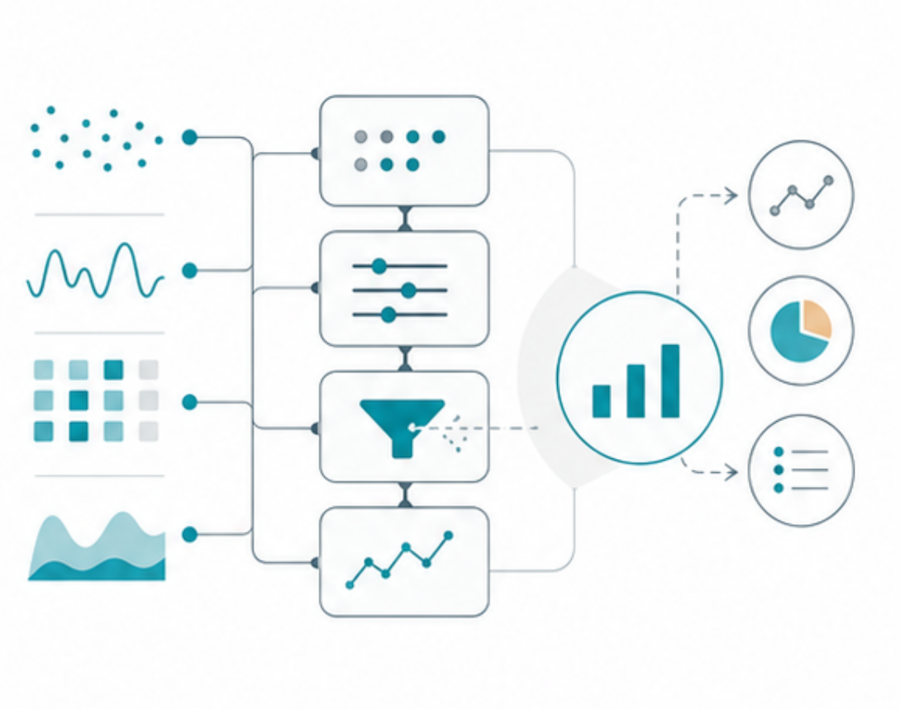
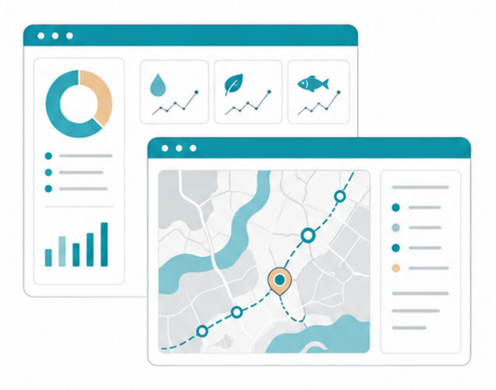
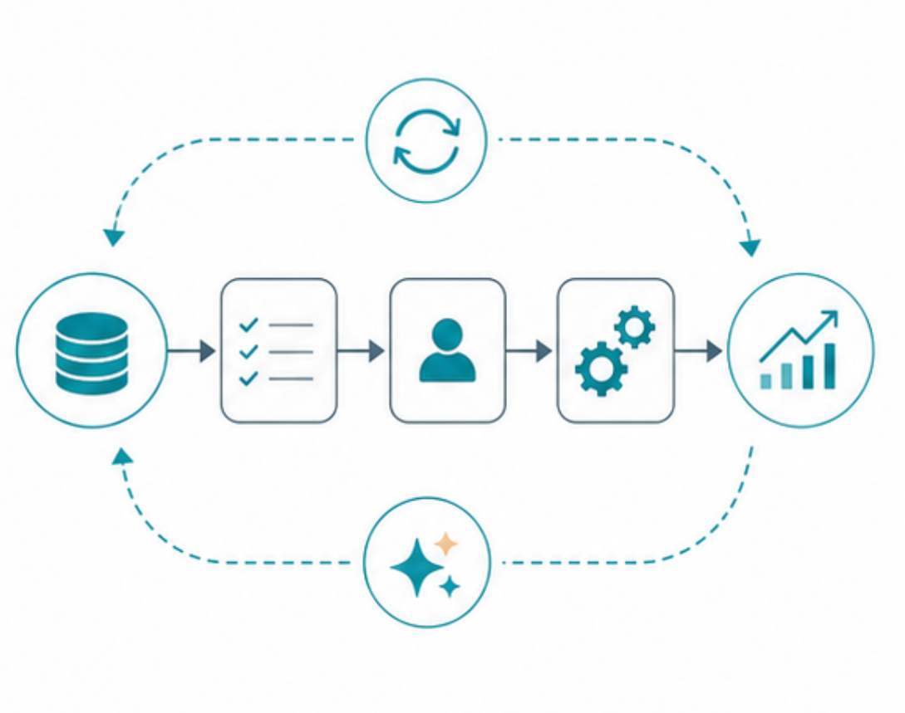

```{=html}
<script>
document.addEventListener('DOMContentLoaded', function() {
  var logo = document.querySelector('.slide-logo');
  if (logo) {
    var link = document.createElement('a');
    link.href = 'https://www.insileco.io';
    link.target = '_blank';
    logo.parentNode.insertBefore(link, logo);
    link.appendChild(logo);
  }
});
</script>
```


## Let us start at the end {.transition-slide .center}

### *What might environmental assessment outputs look like?*


## NCEA {#useful-output .full-image-slide data-background-image="img/ncea.png" data-background-size="contain" data-background-position="center center" data-background-color="white"}


## What questions are answered? {.transition-slide .center}

### *The current state of the region*

### *Risks to valued components* {.fragment}

### *Pathways of effects* {.fragment}

### *Management & mitigation priorities* {.fragment}


## Then what? {.transition-slide .center}

### *Single set of answers*

### *Assessment quickly becomes outdated* {.fragment}

### *Accumulated knowledge is scattered* {.fragment}


## What if? {.transition-slide .center}

### *Single set of answers*

### ***Can be updated and reused***

### ***Value grows as knowledge accumulates***


## How do we operationalize? {.transition-slide .center}

::: {.fragment}
### *Knowledge management*

</img>

:::

## How do we operationalize? {.transition-slide .center}

### *Analytical capabilities*

</img>
&nbsp;
</img>

## How do we operationalize? {.transition-slide .center}

### *Decision-support tools*

</img>
&nbsp;
</img>
&nbsp;
</img>


## How do we operationalize? {.transition-slide .center}

### *Automated workflows*

</img>
&nbsp;
</img>
&nbsp;
</img>
&nbsp;
</img>


## Knowledge Management 


::: {style="font-size: 90%;"}

:::{.callout-tip icon=false}
### Organize the knowledge

Clear terms, clear categories, clear sources.
:::

:::{.callout-important icon=false .fragment}
### Document it well

People can understand what it means and where it came from.
:::

:::{.callout-caution icon=false .fragment}
### Connect the information

Updates in one place can support many uses.
:::

:::{.callout-note icon=false .fragment}
### Build tools on top

Maps, summaries, and decision support tools become easier to maintain.
:::
:::


## ERSL Google sheet {#ersl_sheets .full-image-slide data-background-image="img/ersl_sheets.png" data-background-size="contain" data-background-position="center center" data-background-color="white"}

## ERSL Hub {#ersl_hub .full-image-slide data-background-image="img/ersl_hub.png" data-background-size="contain" data-background-position="center center" data-background-color="white"}


## Analytical capabilities


::: {style="font-size: 90%;"}

:::{.callout-tip icon=false}
### Turn structured knowledge into analysis

From evidence tables and relationships to indicators, scores, pathways, and maps.
:::

:::{.callout-important icon=false .fragment}
### Run methods consistently

Use the same logic across projects, regions, and update cycles.
:::

:::{.callout-caution icon=false .fragment}
### Test scenarios

Compare assumptions, stressors, mitigation options, and future conditions.
:::

:::{.callout-note icon=false .fragment}
### Reproduce results

When data change, analyses can be rerun instead of rebuilt.
:::
:::

## PBR {#pbr .full-image-slide data-background-image="img/pbr.png" data-background-size="contain" data-background-position="center center" data-background-color="white"}


## Decision-support tools


::: {style="font-size: 90%;"}

:::{.callout-tip icon=false}
### Make results explorable

Let users navigate components, stressors, pathways, locations, and evidence.
:::

:::{.callout-important icon=false .fragment}
### Serve different roles

Managers, analysts, regulators, and partners do not need the same interface.
:::

:::{.callout-caution icon=false .fragment}
### Support defensible decisions

Show where conclusions come from and what assumptions they depend on.
:::

:::{.callout-note icon=false .fragment}
### Reduce friction

Less time searching for context, more time interpreting implications.
:::
:::

## CEA Explorer {#cea_explorer .full-image-slide data-background-image="img/cea_explorer.png" data-background-size="contain" data-background-position="center center" data-background-color="white"}


## Automated workflows


::: {style="font-size: 90%;"}

:::{.callout-tip icon=false}
### Move updates through the system

New data in, checks run, analyses rerun, outputs refreshed.
:::

:::{.callout-important icon=false .fragment}
### Improve timeliness

Routine tasks happen faster and more consistently.
:::

:::{.callout-caution icon=false .fragment}
### Keep people in the loop

Automation supports review; it does not replace judgment.
:::

:::{.callout-note icon=false .fragment}
### Use AI where it helps

Draft summaries, structure evidence, assist querying, never replace sourcing and review.
:::
:::

## nceadfo {#nceadfo .full-image-slide data-background-image="img/nceadfo.png" data-background-size="contain" data-background-position="center center" data-background-color="white"}


## Why does this matter? {.transition-slide .center}

### *Shared memory*

### *Updatable context* {.fragment}

### *Reuse across projects* {.fragment}

### *Operational capacity* {.fragment}


## Benefits to operational capacity

::: {style="font-size: 90%;"}

:::{.callout-tip icon=false}
### Reduce time and cost

Some tasks that take months can start to move in days.
:::

:::{.callout-important icon=false .fragment}
### Reduce key person risk

Critical knowledge is less likely to stay locked in one person or one team.
:::

:::{.callout-caution icon=false .fragment}
### Increase confidence

Methods, sources, and assumptions are easier to review and defend.
:::

:::{.callout-note icon=false .fragment}
### Decrease overall risk

Fewer delays, fewer gaps, and fewer fragile handoffs across the process.
:::
:::

# *inSileco*

## 

:::: {.columns}


::: {.column width="70%"}
### *inSileco*

*Mission*

::: {style="font-size: 70%;"}  
Operationalize environmental management by building the capacity, tools, and systems that environmental professionals and organizations need to work confidently and efficiently.
:::


:::{.fragment}
---

*Collaborations*

::: {style="font-size: 60%;"}  
*Academia (CEM, UofG, UL, ArcticNet, UQAR, UQAT)* 

*Federal (ECCC, AEIC, DFO, CWS)* 

*Provincial (MNR, Nanutsiavut Gvt, MFFP)*

*First Nations (W8banaki, Wendake)*

:::

:::

:::


::: {.column width="30%"}
::: {style="display:flex; flex-direction:column; align-items:center; gap:0px; min-height:520px;"}
<div class="team-card">
  <a href="https://insileco.io/" target="_blank" class="team-photo-link">
    
  </a>

  <a href="https://insileco.io/" target="_blank" class="team-photo-link">
    
  </a>
</div>

<a href="https://insileco.io/" target="_blank" style="display:block; text-align:center; width:100%;">
  
</a>


<div class="team-card">
  <a href="https://insileco.io/" target="_blank" class="team-photo-link">
    
  </a>
  <a href="https://insileco.io/" target="_blank" class="team-photo-link">
    
  </a>
</div>

:::
:::

:::: 

##

### *inSileco*

::: {.columns}
::: {.column}

<center>

::: {style="font-size: 75%;"}
*Knowledge Management*
:::

</img>
</center>

<center>

::: {style="font-size: 75%;"}
*Analytical capabilities*
:::

</img>
</center>

:::

::: {.column}

<center>

::: {style="font-size: 75%;"}
*Decision-support tools*
:::

</img>
</center>

<center>

::: {style="font-size: 75%;"}
*Automated workflows*
:::

</img>
</center>

:::
:::
<!-- end columns -->

##

### *inSileco*

::: {.columns}
::: {.column}
::: {.callout-note .fixed-height icon="false"}
### Blog &nbsp; <a href="https://insileco.io/en/blog" target="_blank"><i class="fa-solid fa-globe"></i></a> <a href="https://www.linkedin.com/company/insileco/" target="_blank"><i class="fa-brands fa-linkedin"></i></a>
::: {style="font-size: 90%;"}
***Insights & practcal guidance***

Free content on environmental data, modeling, and decision-making
:::
:::

::: {.callout-important .fixed-height icon="false" .fragment}
### Academy 
::: {style="font-size: 90%;"}
***Training & capacity building***

Courses, workshops, and coaching to help teams develop internal capacity
:::
:::

:::
::: {.column}

::: {.callout-tip .fixed-height icon="false" .fragment}
### Systems  &nbsp; <a href="https://insileco.io/en/portfolio" target="_blank"><i class="fa-solid fa-globe"></i></a>
::: {style="font-size: 90%;"}
***Custom tools & data systems***

Decision-ready pipelines, models, and applications tailored to your needs
:::
:::

::: {.callout-warning .fixed-height icon="false" .fragment}
### Intelligence
::: {style="font-size: 90%;"}
***Environmental assessments***

Complete biodiversity, cumulative effects, risk assessments
:::
:::

:::
:::
<!-- end columns -->


# 

::: {style="font-size: 90%;"}

::: {.takeaway}
Environmental management should not only produce answers.
:::

:::

::: {style="font-size: 120%;"}

::: {.takeaway .fragment}
***It should build capacity.***
:::


:::


# 

::: {style="font-size: 150%;"}
***Thank you!***
:::

<br>

<center></img></center>
